# BTP-IITG-CL-DRAFTS-PORTABLE-ECG

Heroku and csv added 

For hardware use Teensy 3.2,3.4, or 3.6 don’t use 4.0+

All circuit diagram there in slides

https://drive.google.com/file/d/1p5M9crNOFxqvVajILjBieAzGlu36n7kr/view?usp=sharing

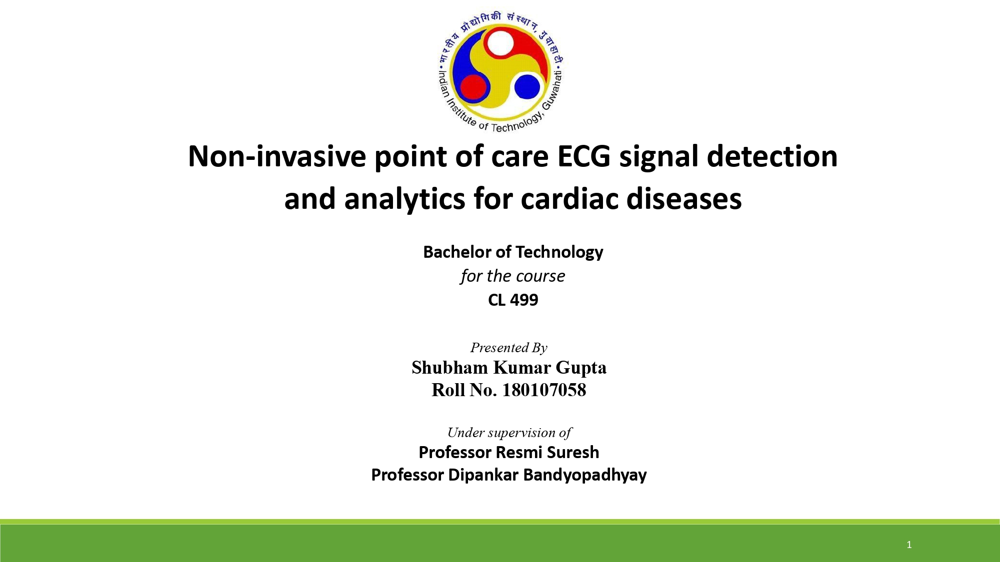

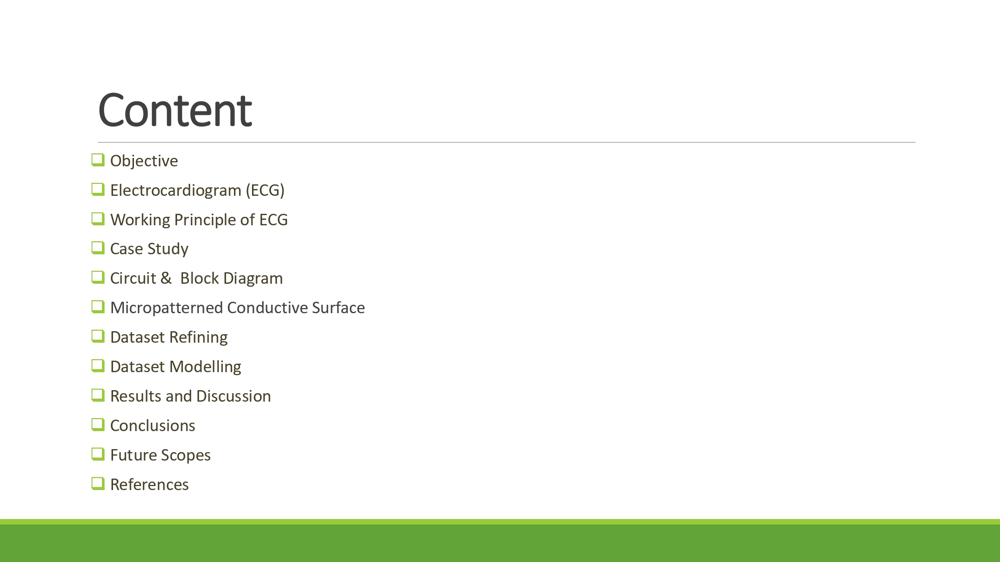

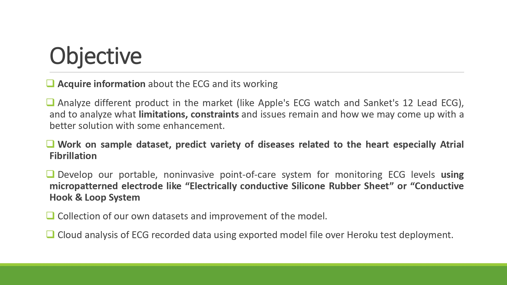

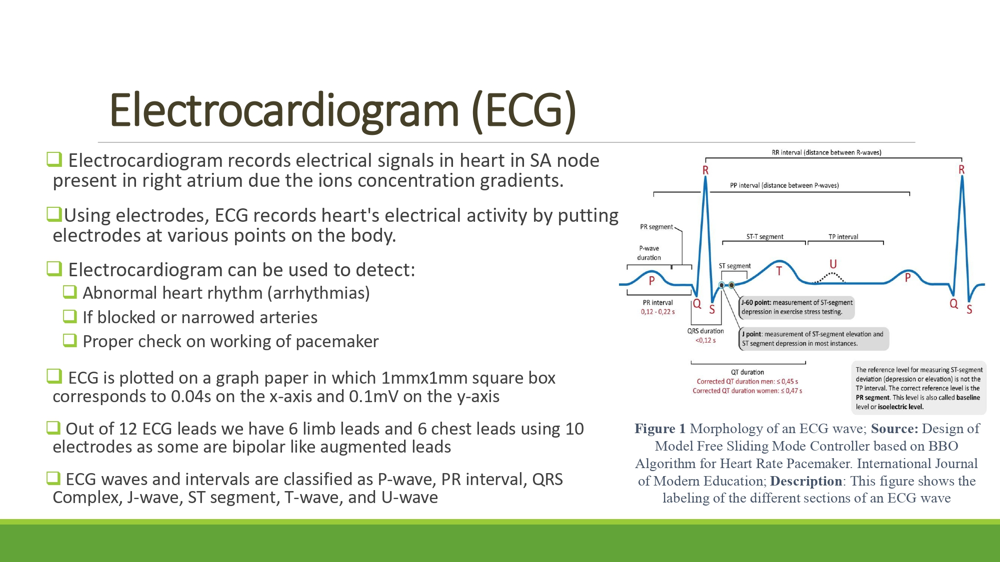

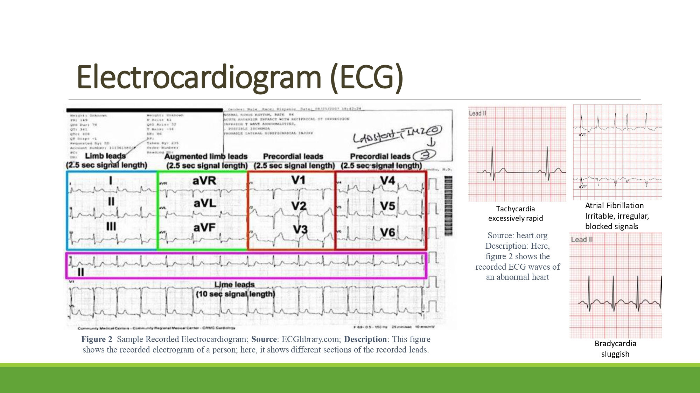

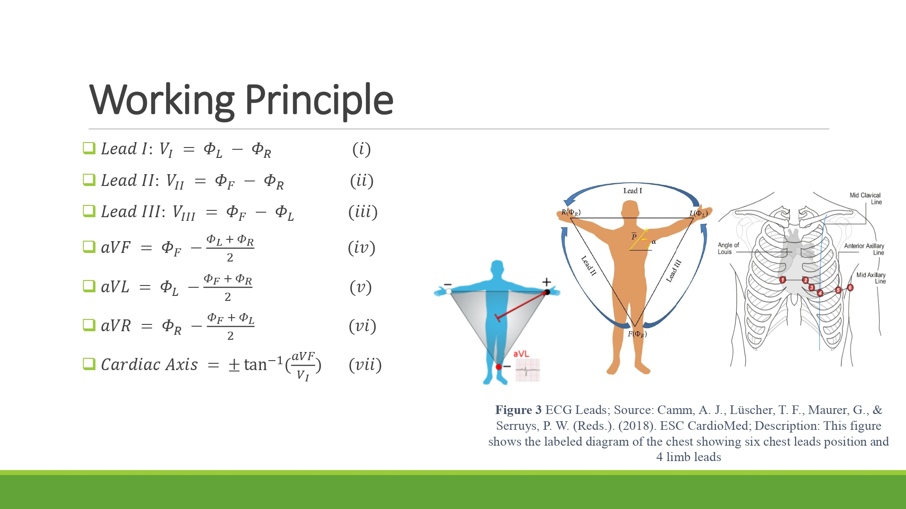

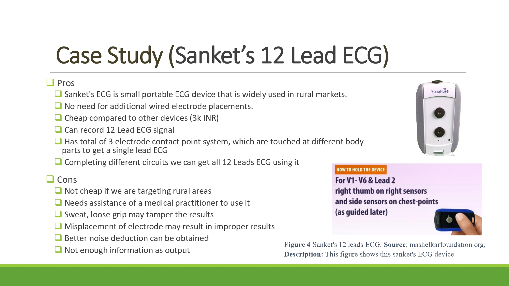

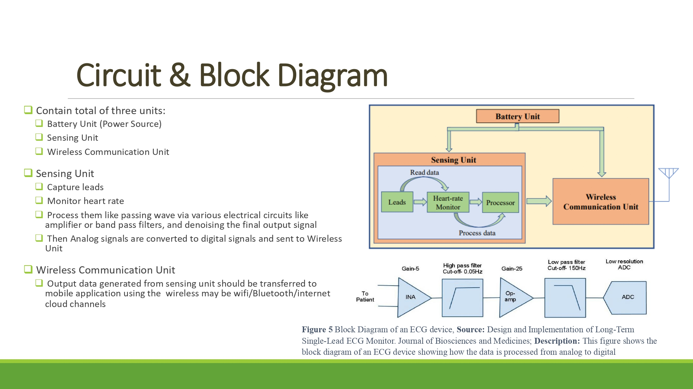

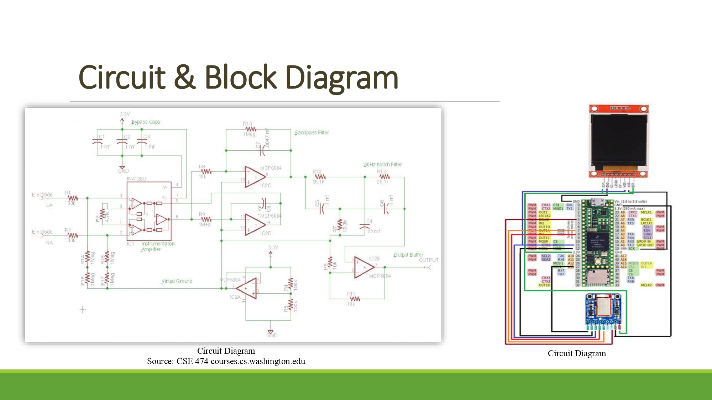

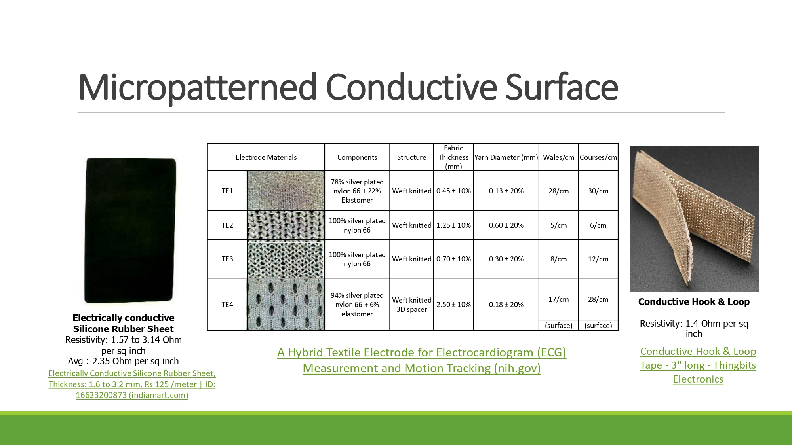

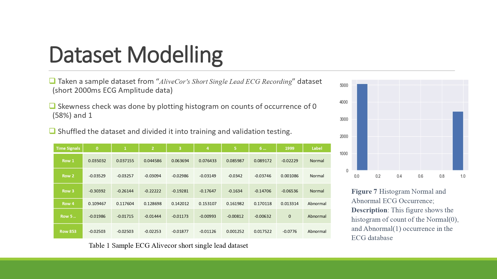

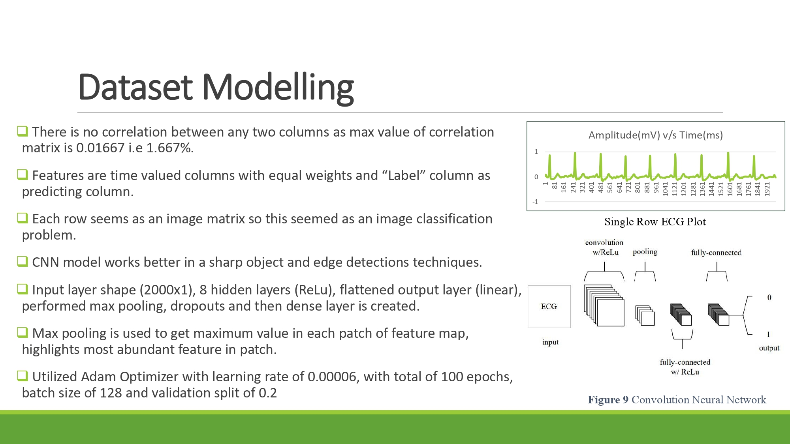

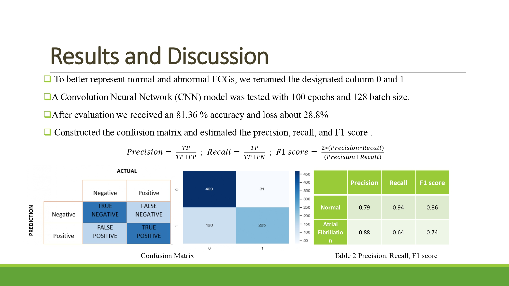

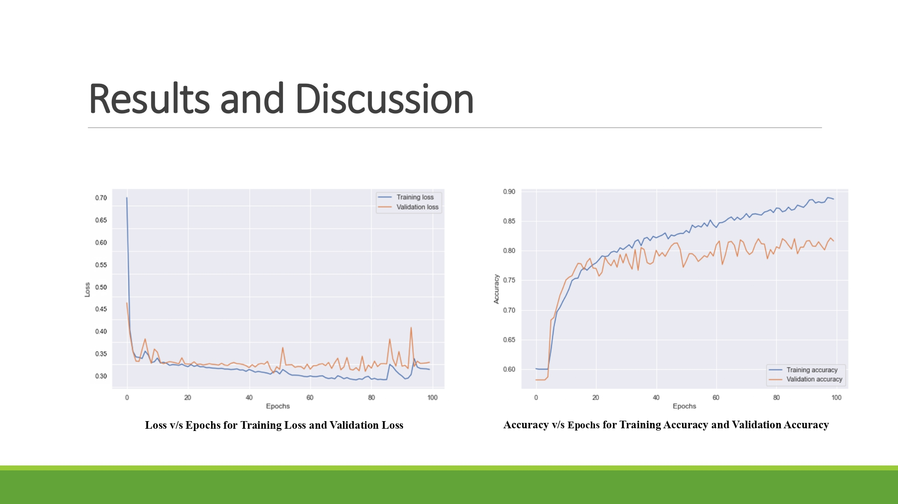

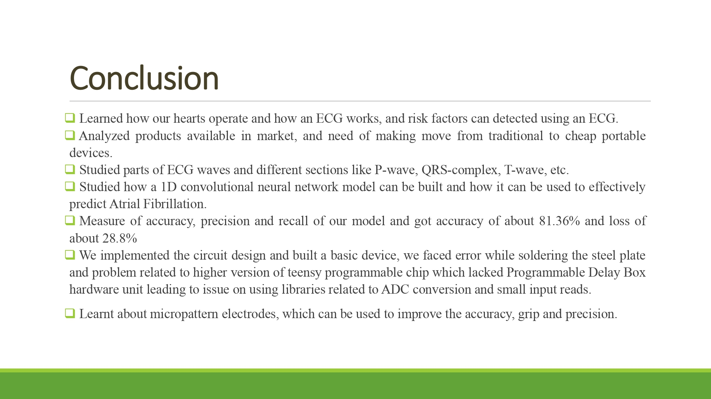

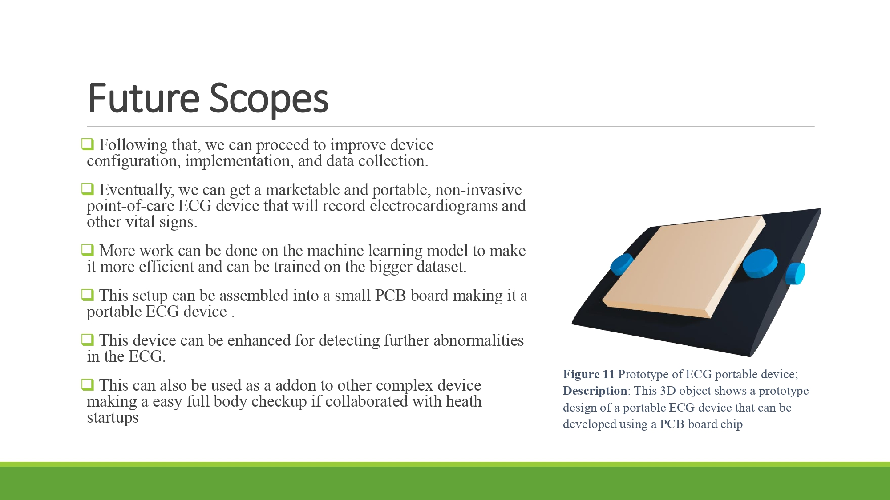
